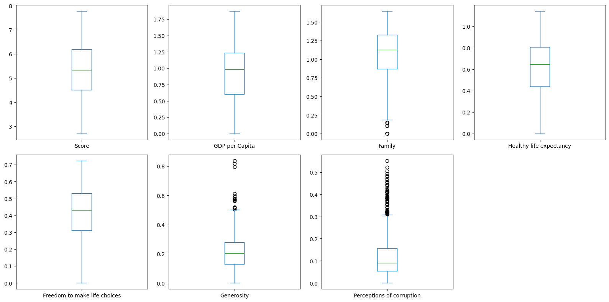
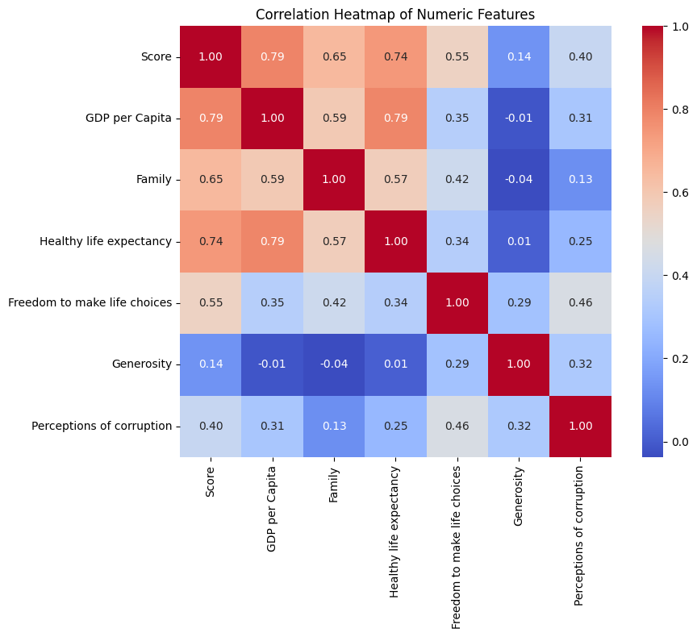

# World Happiness Report EDA (2015\~2019)

## 1. 프로젝트 개요

* 목적: 2015년에서 2019년간의 World Happiness Report 데이터를 통해 국가별 행복 수준의 가정을 보고, 그에 영향을 미치는 여부와 형태를 해석
* 데이터 출처: [Kaggle - World Happiness Report](https://www.kaggle.com/datasets/unsdsn/world-happiness)
* 데이터 구성:

  * 5개 년도 (2015\~2019)
  * 의미적으로 공통적인 10개 컬럼 포함
  * 공통적으로 존재하지 않는 컬럼들은 제거

## 2. 데이터 기본 정보

* 행 수: 대부분 150개 국가, 전체 데이터는 약 750개의 행
* 컬럼 수: 한 년도 기준 12\~14개
* 📊 주요 컬럼 설명
    - Country: 조사 대상 국가 또는 지역의 이름입니다.

    - Family: 필요할 때 의지할 수 있는 가족이나 친구가 있는지에 대한 인식으로, 사회적 지지를 나타냅니다.

    - Freedom to make life choices: 삶의 중요한 결정을 자유롭게 내릴 수 있는지에 대한 인식입니다.

    - GDP per Capita: 1인당 국내총생산(GDP)을 나타내며, 경제적 풍요로움을 측정합니다.

    - Generosity: 기부나 자선 활동에 참여하는 경향을 측정합니다.

    - Happiness Rank: 해당 연도의 행복 점수에 따른 국가의 순위입니다.

    - Healthy life expectancy: 건강하게 살 것으로 기대되는 평균 수명을 의미합니다. (기대 수명)

    - Perceptions of corruption: 정부나 기업의 부패에 대한 인식 수준을 나타냅니다.

    - Score: 국민들이 자신의 삶을 평가한 평균 점수로, 0(최악)에서 10(최상)까지의 척도입니다.

    - Year: 데이터가 수집된 연도입니다.

## 3. 기술 통계 및 데이터 요약

| 컬럼명                          | 평균     | 중앙값    | 표준편차   | 최솟값   | 최댓값     |
| ---------------------------- | ------ | ------ | ------ | ----- | ------- |
| Score                        | 5.377  | 5.379  | 1.141  | 2.693 | 7.769   |
| GDP per Capita               | 0.916  | 0.982  | 0.407  | 0.000 | 2.096   |
| Family                       | 1.078  | 1.125  | 0.330  | 0.000 | 1.644   |
| Healthy life expectancy      | 0.676  | 0.744  | 0.234  | 0.000 | 1.141   |
| Freedom to make life choices | 0.411  | 0.431  | 0.153  | 0.000 | 0.724   |
| Generosity                   | 0.219  | 0.202  | 0.122  | 0.000 | 0.838   |
| Perceptions of corruption    | 0.123  | 0.091  | 0.100  | 0.000 | 0.482   |
| Happiness Rank               | 78.698 | 79.000 | 45.182 | 1.000 | 158.000 |

## 4. 결측치 및 이상치 탐색

* `Perceptions of corruption`, `Generosity` 등에서 발견되는 많은 이상치

## 5. 변수간 관계 분석

### 📊 시각화 자료

**상관관계 히트맵 (heatmap)**

* `GDP per Capita`, `Healthy life expectancy`, `Score`는 강한 양의 상관관계 보임

## 6. 파생 변수 생성 및 전처리 제안

* `Score_Level`: 수치값을 4개 그룹(Low\~Very High)으로 구획
* 모든 열 상용 시 관계성 및 중복 열 발생 ==> 모든 연도에 의미적으로 공통적인 열만 사용

## 7. 요약 및 인사이트 도출

### ✅ 상위/하위 국가의 변수 특징 비교

* **행복 점수 상위 10개국**은 전반적으로 다음과 같은 특성을 보임:
    + 국가: `Finland, Norway, Denmark, Iceland, Switzerland, Netherlands, Sweden, New Zealand, Canada, Austria`

        * 높은 `GDP per Capita` (경제력)
        * 긴 `Healthy life expectancy` (건강 기대 수명)
        * 높은 `Family` 점수 (사회적 지지)
        * 낮은 `Perceptions of corruption` (부패 인식)

* **행복 점수 하위 10개국**은 다음 특성이 공통적으로 관찰됨:
    * 국가: `Burundi, Central African Republic, South Sudan, Tanzania, Rwanda, Yemen, Malawi, Haiti, Syria, Botswana`  

        * 낮은 경제력과 건강 기대 수명
        * `Freedom to make life choices`가 낮음
        * `Perceptions of corruption`은 상대적으로 높음 또는 신뢰성 낮음

> 상위/하위 국가 간 변수 차이는 모델링 관점에서 중요한 피처 엔지니어링 힌트를 제공하며, 행복에 영향을 주는 핵심 변수 식별에도 도움을 준다.

* 상위 10개국: `Finland`, `Norway`, `Denmark` 등 OECD 국가 대부분
* 하위 10개국: `Rwanda`, `Syria`, `South Sudan`과 같은 미건제 범위 국가

> 이후의 모델 구조나 전처리 방향성에 가장 중요한 역할을 하는 컬럼은 `GDP per Capita`, `Healthy life expectancy`, `Family`로 판단됨
